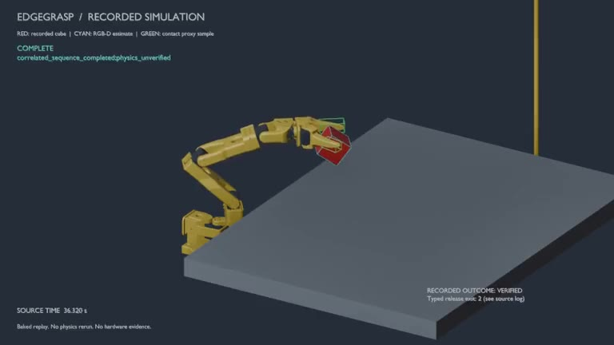

# EdgeGrasp Sim

EdgeGrasp 是基于 SO-101 的机器人仿真与验证项目：从 RGB-D 定位，经 MoveIt
规划和受控执行完成抓取，再由独立物理观察器判断是否真的接触、抬升和保持。
已有录包可以自动转换成 Blender 动画，直观看到动作、识别偏差和停止原因。

后续安排见 [项目路线图](docs/roadmap.md)；下一阶段是
[正常释放与完整操作循环](docs/tasks/next-release-cycle.md)。

## 当前进度（2026-09-06）

**限定三位置的模拟抓取已经成功；抓取后的正常释放仍未成功，真实机器人尚未验证。**

| 工作项 | 当前结果 | 限制 / 下一步 |
| --- | --- | --- |
| RGB-D 定位 | 固定桌面、单个初始静止的 50 mm 红色方块；感知使用 RGB、深度、标定和相机 TF | 只验证了声明的视角和范围，不是任意物体识别 |
| 规划与抓取 | control、X−1 mm、X+1 mm 均完成规划和有界执行 | 两个平移位置使用已验证的小角度夹爪偏航调整；原始无解规划保留 |
| 独立物理判定 | 三位置均通过同帧双指接触、≥20 mm 抬升和 ≥0.5 s 保持；保持抬升分别为 28.85、28.91、28.68 mm | COMPLETE 与物理 VERIFIED 分开判断，不代表整个工作空间成功 |
| 正常释放 | 三次成功抓取的类型化释放均未成功，使用既有回退完成运行清理 | 待修复并独立验证释放流程，尚不是完整 pick-and-place |
| Blender 回放 | 成功与安全停止样例均已生成，支持 .blend、预览图和 MP4 | 只回放记录，不重新计算物理，也不补充实机证据 |
| 可复用流程 | 项目 Skill、转换/校验脚本、清理盘点和 runbook 已提供 | 清理盘点不等于删除；此前工具拒绝的清理仍未完成 |
| 真实硬件 | 未运行 | 需要另行授权和校准、停止/释放等实机验证 |

三个成功录包的 1821 条原子观测中，1817 条通过最近邻真值精度比较；
4 条超限以及所有历史失败均保留。详见 [抓取结果](docs/rgbd-static-grasp-result.md)、
[逐位置验证](docs/observations/2026-09-06-rgbd-final-validation.json) 和
[41 个实验目录索引](docs/observations/2026-09-06-rgbd-artifact-inventory.json)。

## 回放演示

[](docs/media/rgbd-grasp-replay.mp4)

[播放或下载压缩 MP4](docs/media/rgbd-grasp-replay.mp4) · 23.10 秒 · 768×432 · 30 FPS · 约 90 KiB。
点击预览图进入视频文件；若页面未内嵌播放，下载后播放即可。
红色是记录的方块位姿，青色是 RGB-D 识别框，绿色是有接触样本的碰撞代理区域。
字幕分别显示动作阶段和整次实验的历史物理结果；`physics_unverified` 的序列终态文字
不等同于右下角独立观察器的 VERIFIED。视频保留抓取后的变化，没有截去释放阶段。
[媒体来源与压缩命令](docs/media/README.md)。

## 完整工作流

```text
固定场景与相机 → RGB / 深度 / 标定 / TF → 方块中心与姿态
       → 身份、时间、坐标和新鲜度检查 → MoveIt 无执行规划
       → 类型化轨迹门控 → 接近 → 下探 → 闭合 → 抬升
       → 独立接触 / 抬升 / 保持判定 → 释放与清理结果分别记录
       → MCAP + 模型 + 日志 → 离线转换 → Blender 烘焙动画
       → 重新打开逐帧核对 → 预览 / MP4 → 临时文件盘点与受限清理
```

1. **准备环境与检查代码**：Windows 可做静态/单元检查；实际实验依赖现有
   Ubuntu 24.04 / ROS Jazzy、Gazebo、固定上游 SO-101 工作区和 NumPy 感知依赖。
   见下方 core quick start 和 [Ubuntu runbook](docs/ubuntu-jazzy-runbook.md)。
2. **执行一个获授权的本地实验**：先通过对应场景的无执行规划，再做有界抓取；
   每次写入新的外部实验目录。完整参数和三个位置的命令见
   [RGB-D 复现说明](docs/rgbd-static-grasp-result.md#复现)。
3. **核对结果**：分别检查序列、独立物理判定、观测精度、正常释放与回退日志。
   不用“程序退出”或“动画看起来夹住了”替代物理判定。
4. **离线制作回放**：输入已有实验目录和匹配 SDF，使用新输出目录运行下列命令。
   转换不启动 ROS 节点、Gazebo 或控制器，不发送动作。
5. **交付与维护**：保留源录包、最终成功/失败回放、校验记录；只审核冗余下载与
   已被替代的中间产物。见 [清理 runbook](docs/blender-replay-cleanup.md)。

```powershell
# 已有可用 Blender 时直接使用，不必重复下载安装。
powershell -NoProfile -File scripts/install_blender_portable.ps1

# Run / World 为现有 WSL 路径；Output 必须是新的 Windows 目录。
powershell -NoProfile -File scripts/run_blender_replay.ps1 `
  -Run /home/edgegrasp/ros2_ws/test_results/rgbd_measured_pad_trial_20260906b `
  -World /home/edgegrasp/ros2_ws/install/edgegrasp_ros/share/edgegrasp_ros/worlds/table_cube_candidate024_face_aligned.sdf `
  -Output C:/Users/huang/Documents/edgegrasp-replays/my-new-replay `
  -RenderVideo
```

这些路径是已验证机器的示例，换机器需准备依赖和源数据并修改路径。
**仅克隆仓库可以看演示、检查代码；不能凭空重建未上传的原始录包。**
省略 `-RenderVideo` 可只生成 `.blend`、两张预览和验证报告。
[完整 Blender 使用说明](docs/blender-replay.md) 包含视角切换、时间插值和缺口显示规则。

## Skill、验证和交付范围

在本项目可调用 `$edgegrasp-blender-replay`，或直接读取
[SKILL.md](.agents/skills/edgegrasp-blender-replay/SKILL.md)。它复用项目脚本，
覆盖回放、验证和清理审核；清理盘点脚本不执行删除，也不能改变工具权限。

- Windows 全量检查：`powershell -NoProfile -File scripts/check.ps1`；本次发布前
  348 项通过、3 项明确跳过，三个场景各 100 次确定性回放通过。
- WSL RGB-D/ROS 检查：`bash scripts/check_rgbd.sh`；此前验证 26 项通过。
- 回放校验：成功/失败样例分别核对 5,494 / 3,968 个变换，无覆盖区间内缺口；
  见 [回放验证收据](docs/observations/2026-09-06-blender-replay-validation.json)。
- 仓库包含代码、测试、Skill、runbook、证据摘要/索引与压缩演示；
  Blender 安装目录、原始 MCAP、完整 .blend 和全部原始日志保留在本地。
- 仍待解决：正常释放、扩大姿态/物体范围的独立实验，以及另行授权的硬件阶段。
  `accepted_goal_result_timeout_verified=false` 和
  `strong_move_group_request_id_correlation=false` 保持不变。

学习背景见 [中文图文学习博客](docs/learning-blog/README.md)。以下旧基线单独保留，
其中的测试数量和 runtime 状态属于其标注日期，不覆盖上面的最新 RGB-D 与回放结果。

<details>
<summary>历史证据基线：2026-08-30，含 2026-09-05 注入来源更新</summary>

Baseline snapshot: 2026-08-30, Asia/Shanghai. Simulator counts below are from
the 2026-08-29 snapshot; the injected provenance update is dated 2026-09-05.
References to "current" inside this historical section refer to those snapshots.

| Layer | Observed result | Claim boundary |
| --- | --- | --- |
| Deterministic core | The current Windows checkout collected 332 tests: 330 passed and two pinned-local-checkout tests skipped because that optional checkout was absent; the earlier fully pinned snapshot passed 332/332. The 0/20/40 mm/s scenarios replay identically 100 times | Core replay determinism, not physics determinism |
| Python/ROS packaging | Root distribution import, complete-monorepo ament adapter, negative isolated-copy test, and the five-package Jazzy verification pass 129/129 selected tests (`core=1`, `interfaces=0`, `ros=49`, `adapter=34`, `grasp_sequence=45`) | `edgegrasp_core` is intentionally monorepo-layout dependent |
| ROS safety boundary | `edgegrasp_ros` collects and passes 49 Jazzy tests, including typed target publication, ExecuteTrajectory correlation, fake FJT, simulated-clock watchdog, PlanningScene/ACM confirmation, all-pad physics observation, and injected/fake fail-closed late/cancel/send/result paths | These dependency-injected contracts are not real MoveGroup or physical-stop evidence; XML has zero failures/errors/skips, and an earlier intermittent rclpy teardown warning remains tracked |
| MoveIt adapter | The P12d five-package artifact passed 34/34 `edgegrasp_moveit_adapter` tests; its focused in-process fake runner passed 12/12 tests, 12 JSONL records, and 15/15 required facets | The focused result is fake-dependency evidence, not real MoveGroup health; package and historical-negative real-process evidence remain separately classified |
| Gazebo controllers | Three controllers active, six joint states observed, arm and gripper FJT actions accepted conservative gated goals | Controller execution is not grasp success |
| MoveIt | The unique EdgeGrasp overlay loaded OMPL/Pilz/STOMP, injected Pilz `ValidateSolution`, disabled direct MoveGroup execution, and exposed both distal-pad links in the runtime model; candidate005 then completed through that proxy planning model | These are scoped path/execution checks, not minimum-clearance or whole-robot collision fidelity |
| Shared PlanningScene | The scene contract generated Gazebo's table/cube world; MoveIt runtime-confirmed both objects and a selective ACM where only the two distal-pad child links may contact the retained cube | The selective transition is still manual; parent links remain forbidden and no target-to-pad physics claim follows from ACM configuration |
| Target-to-controller path | A reachable immutable pose ran through tf2, `/compute_ik`, MoveGroup `plan_only`, trajectory validation, EdgeGrasp gate, and arm FJT; controller returned status 4 | One simulated arm trajectory, not autonomous pick-and-place |
| Four-stage sequence and physics observer | 60 dependency-free sequence tests and 45 Jazzy action/client tests pass. The fixed Candidate024 control produced 10 correlated simulation-physics successes across 11 runtime attempts; three selected distinct target poses then passed one bounded typed execution each | Evidence is limited to the fixed control plus three shoulder-pan-symmetry poses in the same proxy setup; it is not physics determinism or hardware grasp evidence |
| Distinct-target plan-only matrix | A fixed Candidate024-derived matrix matched 20/20 hypotheses: ten shoulder-pan-symmetry targets passed all 30 arm segments, four invalid scenes were rejected before ROS startup, and six distant targets were rejected by MoveIt. False accept, false reject, unverified, and motion-side-effect counts were all zero | Each distinct target ran once and every trajectory was discarded; this is planning coverage, not execution or grasp evidence |
| Representative distinct-target typed runtime | The near-control pose and both declared shoulder-pan range endpoints each completed `PlanTarget -> ExecuteTrajectory -> FJT`; all 12 correlated command terminals succeeded, both pad tokens remained observed, retained lift was 28.965-29.095 mm, and the 0.5 s retention gate passed | Three selected targets, one run each; not a per-target repeatability result, workspace-wide success rate, full collision-fidelity proof, or hardware evidence |
| Camera/world/contact | Pinned world published color/depth/camera-info; generated primitives replaced 13 collision meshes. Candidate024's 14 fixed-plus-selected runtime logs contained zero tracked DART mesh/geometry-construction diagnostics, and all 13 successful runs had both configured distal-pad contacts through lift retention | Log absence alone is not collision proof; only one base proxy has isolated behavior evidence and the robot still uses conservative primitive collision proxies |
| MCAP | Jazzy ros_sim record and raw-input replay ran; 27 target records matched bag receive time within ±1 ms | Wrapper/gate replay only; no planner/backend/physics replay |
| Real hardware | Not run | Hardware, calibration, camera extrinsics, and grasp success remain unverified |

### MoveIt evidence matrix

These classes are deliberately non-interchangeable. The two fail-closed tracks
are recorded explicitly so that a fake dependency result cannot be read as
real MoveGroup health:

| Evidence class | Result | Strict boundary |
| --- | --- | --- |
| `REAL_MOVEGROUP_NORMAL` | `PASS_SCOPED`: the independent Candidate024 target matrix used the real MoveGroup process under the EdgeGrasp proxy overlay for normal `GetMotionPlan`; 20/20 outcomes matched, 30 accepted trajectories were validated and discarded, and trajectory publication, ExecuteTrajectory, FJT, and execution counts were all zero | Normal plan-response/validation evidence only; it does not prove cancel, timeout, late-result, or whole-process health |
| `B · INJECTED_CANCEL_TIMEOUT` | `summary.status=PASS`, `overall_pass=true`: `/home/edgegrasp/ros2_ws/test_results/injected_moveit_fail_closed_20260830T121122P12d` passed 12 focused tests, 12 JSONL records, and independently validated 15/15 facets with zero failures, errors, skips, and validator errors. It directly observes accepted-goal result-future timeout, exact request/generation/UUID joins, delayed MoveGroup and typed-gate goal responses, gate `get_result_async()->None` and `result()` exception, terminal-confirmed/unconfirmed paths, success-after-cancel fail-closed behavior, MoveGroup result-future-unavailable fail-closed behavior, old-generation late-CANCELED isolation, old-generation late-SUCCEEDED isolation, and explicit cancel | Injected in-process fake runtime only. The MoveGroup result-future-unavailable case is an adapter-seam monkeypatch before a real ClientGoalHandle result future exists; it is not real MoveGroup evidence. The injected positives are `accepted_goal_result_timeout_verified_injected`, `accepted_goal_result_future_timeout_verified_injected`, `strong_move_group_request_id_correlation_verified_injected`, `gate_delayed_goal_response_cancel_verified_injected`, `gate_result_future_unavailable_verified_injected`, `gate_result_exception_verified_injected`, `move_group_result_future_unavailable_verified_injected`, and `old_generation_late_success_isolation_verified_injected`; unqualified `accepted_goal_result_timeout_verified=false`, `accepted_goal_result_future_timeout_verified=false`, `strong_move_group_request_id_correlation=false`, `move_group_result_future_unavailable_verified=false`, and `old_generation_late_success_isolation_verified=false` remain unchanged. All real MoveGroup, controller, simulation-physics, and hardware fields remain false. P12d does not establish real MoveGroup, controller, simulation-physics, or hardware evidence |
| `A · REAL_MOVEGROUP_CANCEL_RACE_NEGATIVE_EXISTING_ARTIFACT` | `summary.status=UPSTREAM_PROCESS_EXITED`, `overall_pass=false`: the two frozen 2026-08-29 P2 runs kept `edgegrasp_fail_closed=true` and zero actual motion goals, but each real MoveGroup run recorded one SIGSEGV and exit `-11` in `libmoveit_plan_execution.so.2.12.4` `PlanExecution::stop()`; `move_group_survived=false` | Historical negative artifact only; it is not a healthy-runtime PASS and the OS-process interruption is not rerun. `accepted_goal_result_timeout_verified=false` and `strong_move_group_request_id_correlation=false` remain boundaries |

Track A and Track B are complementary, not cumulative: Track A shows the
EdgeGrasp fail-closed response while the upstream process failed; Track B
shows the adapter contract with an in-process fake dependency. Neither track
is a controller-stop or hardware-grasp result.

The machine-readable P2 boundaries and hashes are in the
[MoveIt evidence matrix](docs/observations/2026-08-29-moveit-evidence-matrix.json)
and the full frozen P2 details are in the
[real MoveGroup negative observation](docs/observations/2026-08-29-real-moveit-fail-closed-runtime.json).
The earlier two-test baseline remains in the
[initial in-process injected observation](docs/observations/2026-08-30-injected-moveit-fail-closed-runtime.json).
The historical P8 8-test result and its source/artifact hashes remain in the
[P8 accepted-result timeout and correlation observation](docs/observations/2026-08-30-injected-moveit-result-timeout-correlation-runtime.json).
The historical P10 10-test result remains in the
[P10 injected observation](docs/observations/2026-08-30-injected-moveit-result-timeout-correlation-v2-runtime.json).
The P11 result remains historical in the
[P11 injected observation](docs/observations/2026-08-30-injected-moveit-result-timeout-correlation-v3-runtime.json).
The 2026-08-30 injected result is recorded in the
[P12d injected observation](docs/observations/2026-08-30-injected-moveit-result-timeout-correlation-v4-runtime.json).
The historical P12d artifact path, source pins, hashes, package-scoped 129/129
verification, and claim boundary are in the [validation report](docs/validation-report.md)
and [Ubuntu/Jazzy runbook](docs/ubuntu-jazzy-runbook.md).
The subsequent [2026-09-05 source-provenance run](docs/observations/2026-09-05-injected-source-provenance-runtime.json)
passed 12/12 injected Jazzy tests and 15/15 facets with matching imported-source
hashes. It does not replace the historical P12d five-package verification.
No injected result is represented as real MoveGroup evidence in the frozen P2 files.
The executable P2 OS-signal harness is intentionally excluded from this
standalone repository; only its frozen hashes and negative-result metadata are
retained. Repository-specific automation boundaries are in [AGENTS.md](AGENTS.md).

Exact commands, interpreter versions, counts, and failures are in the
[validation report](docs/validation-report.md). The staged design is in the
[simulation plan](docs/simulation-plan.md), the reproducible ROS procedure is
the [Ubuntu/Jazzy runbook](docs/ubuntu-jazzy-runbook.md), and source pins and
licenses are in the machine-readable
[upstream manifest](docs/upstream-manifest.json). The latest table collision
cases are preserved in the machine-readable
[PlanningScene runtime observation](docs/observations/2026-08-27-planning-scene-runtime.json),
the [sequence runtime observation](docs/observations/2026-08-27-grasp-sequence-runtime.json).
The corrected 10-run harness, retained failures, summary hash, and strict
claim boundary are in the
[sequence repeatability observation](docs/observations/2026-08-27-grasp-sequence-repeatability.json).
The task004-task006 fix progression and final live negative grasp evidence are
in the
[final grasp-trial observation](docs/observations/2026-08-27-grasp-trial-final-runtime.json).
The later Pilz response-adapter fix, identical-path collision rejection, safe
approach, explicit target-contact scene policy, and contact-without-lift result
are in the
[Pilz collision/contact observation](docs/observations/2026-08-27-pilz-collision-contact-runtime.json).
For the candidate-by-candidate experiments, including rejected hypotheses and
retained failures, see the [candidate lab](docs/learning-blog/07-candidate-lab.md),
[observations](docs/observations/), and [reproduction runbook](docs/ubuntu-jazzy-runbook.md).
The current scoped results and limitations are summarized above.

</details>

## Quick start: deterministic core

Python 3.10 or newer:

```powershell
git clone https://github.com/znbsf/edgegrasp-sim.git
cd edgegrasp-sim
py -3.10 -m venv .venv
.\.venv\Scripts\python.exe -m pip install -e ".[dev]"
powershell -NoProfile -File scripts\check.ps1 -ReplayRuns 100 `
  -PythonExecutable .\.venv\Scripts\python.exe
```

Ubuntu/CI:

```bash
python3 -m pip install -e '.[dev]'
bash scripts/check.sh 100
```

A standalone clone intentionally does not vendor the pinned SO-101 checkout.
The private-release preflight therefore passed 330 tests and skipped two
checkout-dependent collision-contract tests. The documented full development
layout, with the exact clean `so101_ros2` pin available outside this repository,
passed 332/332. Both modes run the same deterministic replay and structure
gates; a skip is never reported as runtime simulator evidence.

Useful focused checks:

```powershell
python -m pytest --collect-only -q
python -m pytest -q
python -m edgegrasp replay --runs 100
python scripts\benchmark_replay.py --runs 100 --horizon-ms 100
python scripts\validate_project.py
powershell -NoProfile -File scripts\audit_environment.ps1 -IncludeWsl
```

The README uses `bash scripts/...` so commands remain portable when a Windows
tool or archive loses executable mode bits. Git Bash `bash -n` is a syntax
check, not Ubuntu/ROS execution evidence.

## Architecture

The deterministic core remains independent of ROS:

```text
sensor/input
  -> Target3D(position, source timestamp, base_link, domain, epoch)
  -> constant-velocity predictor
  -> EndpointWorkspaceGate
  -> EdgeGraspController + watchdog + state machine
  -> synchronous backend(mock | disabled gazebo | disabled real)
```

`EndpointWorkspaceGate` checks only endpoint AABB reachability/blocking. It is
not IK, swept-path, geometry, or collision-safe planning; the rejection reason
is `endpoint_blocked`.

The ROS motion path is deliberately separate:

```text
PointStamped target -> safety_monitor -> /edgegrasp/motion_allowed

PlanTarget.action immutable pose
  -> timestamped tf2 to base_link
  -> confirmed shared PlanningScene table readiness
  -> bounded /compute_ik with fresh /joint_states seed
  -> moveit_msgs/action/MoveGroup, planning_options.plan_only=true
  -> RobotTrajectory validator
  -> /edgegrasp/execute_trajectory (typed arm command)
  -> trajectory_gate with exact identity, digest, and source-stamp echo
  -> /arm_controller/follow_joint_trajectory
```

Gripper commands use the same typed gate action with
`controller=gripper_controller` and their own FJT action. The legacy request
topics remain diagnostic adapters, not the correlated sequence path. The
adapter never calls MoveIt execution, never publishes a combined
`arm_with_gripper` trajectory, and never sends directly to a controller.
MoveIt `RobotTrajectory` is not coerced into the core Cartesian `MotionPlan`.

The typed sequence path composes those interfaces without guessing from topic
order:

```text
GraspSequence.action immutable task
  -> immutable approach orientation for collision routing
  -> immutable grasp orientation shared by descend and lift
  -> APPROACH: PlanTarget -> matching ExecuteTrajectory terminal
  -> DESCEND: PlanTarget -> matching ExecuteTrajectory terminal
  -> CLOSE_GRIPPER: ExecuteTrajectory(controller=gripper_controller)
  -> LIFT: PlanTarget -> matching ExecuteTrajectory terminal
  -> COMPLETE (sequence_completed=true; protocol result only)
  -> independent GraspPhysicsEvidence terminal
```

Every stage uses the latest fresh `TrackedTarget` observation for the same
immutable target and rejects geometry drift. A stage advances only after the
outer wrapper action is terminal, the exact task/command/stage/sequence/digest
matches, and the downstream FJT has a legal terminal status. Untrusted terminal
evidence retains the downstream slot and blocks reset.

The independent physics observer requires every configured pad token in the
same contact sample before contact can refresh the retention clock. Separate
hits at different times are insufficient. Even same-sample contact remains
insufficient without at least 20 mm cube lift and a complete retention window.
Candidate024 is the first case where that independent observer returned
`physics_grasp_verified=true`; `GraspSequence` itself still never makes the
physics claim.
It also records contact depth/wrench maxima, gripper joint effort, and
first/last source timestamps as diagnostics. Those fields do not weaken the
success gate and must not be interpreted as calibrated force or force closure.

## Implemented fail-closed contracts

- `execute_now_ns` is required after planning; there is no unsafe receive-time
  default. Slow planning, clock rollback, or a target older than 200 ms blocks
  execution.
- Core `tick(now_ns)` independently stops on target-stream silence greater
  than 200 ms; the exact 200 ms boundary is allowed and repeated ticks are
  idempotent.
- Core and ROS reject invalid/future/out-of-order timestamps, wrong frame,
  wrong domain/epoch, low confidence, malformed plans, incorrect joint order,
  nonfinite arrays, non-increasing time, stale start state, and conservative
  position/velocity/acceleration violations.
- The first target frame is `base_link`. Mock targets are already expressed in
  that frame. ROS MoveIt requests use timestamped tf2 with bounded failure;
  no implicit `world` or camera conversion exists.
- ROS gate admission requires recent permission, target receive liveness,
  joint states, interface readiness, and the two exact pinned FJT endpoints.
- Permission loss, watchdog expiry, result timeout, or clock fault requests
  cancellation. Cancel rejection/exception/timeout—and an accepted cancel that
  never reaches a terminal result—latches an error, retries at most three
  times, then requires controller-level stop escalation. The project does not
  equate “cancel requested” with “robot stopped.”
- The pure backend contract is synchronous. The ROS action adapters are
  explicitly asynchronous and track one in-flight request with correlation,
  cancellation, and late-result suppression.

`PointStamped` cannot transport target identity or clock domain/epoch, so the
legacy safety wrapper still owns a local epoch. The mock publisher also
publishes `TrackedTarget` with atomic target ID, source stamp, domain, and
epoch; the sequence wrapper consumes this typed stream and is fake-action
runtime-tested. Coordinated reset/epoch propagation across all nodes remains
future work.

## MCAP single-clock contract

Recording profiles:

```bash
# Gazebo/ros_sim: waits for /clock and records with --use-sim-time.
bash scripts/record_mcap.sh /path/to/bag ros_sim

# Mock/system clock: does not use --use-sim-time.
bash scripts/record_mcap.sh /path/to/bag system
```

Derived status, command-request, cube-pose/contact, sequence-terminal, and
physics-status topics are intentionally recorded for comparison. Default
safety replay never replays them:

```bash
# Stop Gazebo/MoveIt/controllers and confirm no existing /clock publisher.
ros2 launch edgegrasp_ros edgegrasp_replay.launch.py
# In a separate sourced shell:
bash scripts/replay_mcap.sh /path/to/bag
```

The three modes are deliberately separate:

- `SAFETY_REPLAY`: stop Gazebo/controllers, launch only the wrapper/gate, and
  replay the raw allowlist with rosbag as the sole `/clock` authority.
- `GAZEBO_RUN`: Gazebo alone owns `/clock`; never combine it with playback
  `--clock`.
- `OUTPUT_INSPECTION`: manual all-topic playback only in an isolated graph with
  no live monitor, gate, planner, controller, or backend.

The default playback allowlist is only `/joint_states`,
`/edgegrasp/target_3d`, and three raw camera topics. `edgegrasp_replay` has no
planner, MoveIt adapter, backend, or physics. Restart it or coordinate a new
epoch before rewinding the same bag; an unchanged wrapper correctly treats
rewind as clock rollback.

## Upstream composition

- `adoodevv/so101_ros2` @
  `0305e03ab54e64aae9263fcbf339622e654012f3`, BSD-3-Clause: pinned Gazebo,
  ros2_control, camera, controllers, and complete-looking MoveIt configuration.
  The tree and selected runtime paths are verified. Its README is stale about
  both MoveIt completeness and the gripper controller; the actual pinned YAML
  maps both controllers to FollowJointTrajectory.
- `TheRobotStudio/SO-ARM100` @
  `7629d2ad9853d10fb903093a33ef6114099d97e5`, Apache-2.0: geometry,
  URDF/MJCF, mesh, and calibration cross-check. Base collision meshes are
  missing and gripper 0/100 semantics are not encoded. Windows MuJoCo runtime
  remains independently blocked.
- `legalaspro/so101-ros-physical-ai` @
  `58318c905a2c61289fa907de85cb8473322fbe68`, Apache-2.0, Feetech submodule
  `4c0fdbfe16c84c686f8ace09526c52d98d0110ca`: remote pinned reference for
  mock/real, MoveIt, recording, and hardware safeguards. It was not cloned or
  run and has no Gazebo/MuJoCo backend.

No upstream source is copied into this project. Checkouts stay under
`workspaces/` and overlapping SO-101 workspaces are never sourced together.

## Layout

```text
src/edgegrasp/                         deterministic core + pinned contract
tests/                                 Windows/CI core and structural tests
scripts/                               checks, audit, benchmark, MCAP tools
ros_ws/src/edgegrasp_core/             monorepo ament adapter
ros_ws/src/edgegrasp_interfaces/       TrackedTarget + four typed actions
ros_ws/src/edgegrasp_ros/              monitor, probe, FJT gate, launches
ros_ws/src/edgegrasp_moveit_adapter/   IK + MoveGroup plan-only bridge
ros_ws/src/edgegrasp_grasp_sequence/   correlated four-stage action wrapper
docs/                                  runbook, plan, manifest, evidence report
```

## Hardware decision

Hardware purchase remains a user decision. Candidate024's scoped simulation
results support evaluating a hardware phase; they do not authorize a purchase
or hardware access. Before any authorized bring-up, define calibration,
unloaded-motion, stop/release, frame/timestamp, and gripper-mapping checks.
Autonomous grasp remains disabled until those hardware checks pass.

This phase deliberately excludes VLA, GraspNet, FoundationPose, custom
TensorRT kernels, and reinforcement learning. It contains no company-private
code, SDK, model, or data. EdgeGrasp-owned code is MIT licensed; upstreams
retain their licenses recorded in the manifest.
